```python
#Python基础语法
```


```python
#输入输出
name=input("what's your name?")
sum=100+100
print('hello,%s' %name)
print('hello,%s' %sum)
```

    what's your name?qmx
    hello,qmx
    hello,200
    


```python
#判断语句
score=int(input("what's your score?"))
if score>=90:
    print ('excellent')
else:
    if score<60:
        print('fail')
    else:
        print('good job')
```

    what's your score?80
    good job
    


```python
sum=0
for number in range(1,11,2):#从1到11，步长为2
    sum=sum+number
print(sum)
```

    25
    


```python
sum=0
number=1
while number<11:
    sum=sum+number
    number=number+1
print(sum)
```

    55
    


```python
#列表
#等于数组，可增删改查，
lists=['a','b','c','d']
lists.append('d')#尾部添加
print(lists)
print(len(lists))#长度
lists.insert(0,'mm')#插入
lists.pop()#尾部删除
print (lists)
```

    ['a', 'b', 'c', 'd', 'd']
    5
    ['mm', 'a', 'b', 'c', 'd']
    


```python
#元组
#类似列表，不能修改，只能查询
tuples = ('tupleA','tupleB')
print (tuples[0])
```

    tupleA
    


```python
#字典 
#{key,value},可增删改查
score={'guanyu':95,'zhangfei':96}
score['zhaoyun']=98
print (score)
score.pop('zhangfei')
print('guanyu'in score)
print(score.get('guanyu'))
print(score.get('yase',99))
```

    {'guanyu': 95, 'zhangfei': 96, 'zhaoyun': 98}
    True
    95
    99
    


```python
#集合
#与字典类似，只存储key，可修改
s=set(['a','b','c'])
s.add('d')
s.remove('b')
print(s)
print('c' in s)
```

    {'a', 'c', 'd'}
    True
    


```python
#注释
# -*- coding: utf-8 -*
'''
这是多行注释，用三个单引号
这是多行注释，用三个单引号 
这是多行注释，用三个单引号
'''
```


    '\n这是多行注释，用三个单引号\n这是多行注释，用三个单引号 \n这是多行注释，用三个单引号\n'


```python
#引用 import 的本质是路径搜索
# 导入一个模块
import model_name
# 导入多个模块
import module_name1,module_name2
# 导入包中指定模块 
from package_name import moudule_name
# 导入包中所有模块 
from package_name import *
```


```python
#函数
def addone(score):
   return score + 1
print (addone(99))
```

    100
    


```python
#用numpy快速处理数据
```


```python
#numpy中的ndarray多维数组
import numpy as np
a=np.array([1,2,3])
b=np.array([[1,2,3],[4,5,6],[7,8,9]])
b[1,1]=10
print(a.shape)#秩，维度数
print(b.shape)
print(b.dtype)#数据类型
print(b)
```

    (3,)
    (3, 3)
    int32
    [[ 1  2  3]
     [ 4 10  6]
     [ 7  8  9]]
    


```python
#结构数组-自定义数组结构类型
import numpy as np
persontype=np.dtype({
    'names':['name','age','chinese','math','english'],
    'formats':['S32','i','i','i','f']})
peoples=np.array([("zhangfei",32,75,100,90),("guanyu",42,54,53,77),("zhaoyun",56,78,98,57),("huangzhong",34,54,57,76)],dtype=persontype)
ages=peoples[:]['age']
chineses=peoples[:]['chinese']
maths=peoples[:]['math']
englishs=peoples[:]['english']
print(np.mean(ages))
print(np.mean(chineses))
print(np.mean(maths))
print(np.mean(englishs))
```

    41.0
    65.25
    77.0
    75.0
    


```python
#numpy中的ufunc元素级处理函数
#连续数组创建
x1=np.arange(1,11,2)#初始值，终值，步长，不包含终值
x2=np.linspace(1,9,5)#初始值，终值，元素个数，包含终值
print(x1)
print(x2)
```

    [1 3 5 7 9]
    [1. 3. 5. 7. 9.]
    


```python
#算术运算
x1=np.arange(1,11,2)
x2=np.linspace(1,9,5)
print(np.add(x1,x2))#加
print(np.subtract(x1,x2))#减
print(np.multiply(x1,x2))#乘
print(np.divide(x1,x2))#除
print(np.power(x1,x2))#n次方
print(np.mod(x1,x2))#取余
```

    [ 2.  6. 10. 14. 18.]
    [0. 0. 0. 0. 0.]
    [ 1.  9. 25. 49. 81.]
    [1. 1. 1. 1. 1.]
    [1.00000000e+00 2.70000000e+01 3.12500000e+03 8.23543000e+05
     3.87420489e+08]
    [0. 0. 0. 0. 0.]
    


```python
#统计函数
import numpy as np
a=np.array([[1,2,3],[4,5,6],[7,8,9]])
print(np.mean(a))
print(np.min(a))
print(np.min(a,0))#跨行（纵向）
print(np.min(a,1))#跨列（横向）
print(np.max(a))
print(np.max(a,0))
print(np.max(a,1))
print(np.ptp(a))#最大-最小
print(np.ptp(a,0))
print(np.ptp(a,1))
```

    5.0
    1
    [1 2 3]
    [1 4 7]
    9
    [7 8 9]
    [3 6 9]
    8
    [6 6 6]
    [2 2 2]
    


```python
#百分位数
print(np.percentile(a,75))
print(np.percentile(a,75,axis=0))#跨行（纵向）
print(np.percentile(a,75,axis=1))#跨列（横向）
#中位数
print(np.median(a))
print(np.median(a,axis=0))
print(np.median(a,axis=1))
```

    7.0
    [5.5 6.5 7.5]
    [2.5 5.5 8.5]
    5.0
    [4. 5. 6.]
    [2. 5. 8.]
    


```python
#加权平均值
b=np.array([1,2,3,4])#默认为1
wts=np.array([1,2,3,4])#权重设置
print (np.average(b))
print (np.average(b,weights=wts))
```

    2.5
    3.0
    


```python
#标准差、方差
print(np.std(b))
print(np.var(b))
```

    1.118033988749895
    1.25
    


```python
#numpy排序
#sort(a, axis=-1, kind='quicksort’, order=None)最后一轴；快速quick，合并merge，堆heap；根据字段
c=np.array([[4,3,2],[2,4,1]])
print(np.sort(c))
print(np.sort(c,axis=None))
print(np.sort(c,axis=0))
print(np.sort(c,axis=1))
```

    [[2 3 4]
     [1 2 4]]
    [1 2 2 3 4 4]
    [[2 3 1]
     [4 4 2]]
    [[2 3 4]
     [1 2 4]]
    


```python
import numpy as np

persontype = np.dtype({'names':['name','chinese','english','math','total'],'formats':['S32','i','i','i','i']})
peoples = np.array([('zhangfei',66,65,30,0),('guanyu',95,85,98,0),("zhanyun",93,92,96,0),('huanghzong',90,88,77,0),('dianwei',80,90,90,0)],dtype = persontype)
peoples[:]['total']= peoples[:]['chinese'] +peoples[:]['english']+peoples[:]['math']
print("排序前数据：")
print (peoples)
print("表头：")
print(peoples.dtype.names)

for col in peoples.dtype.names:
    if col =='name' or col == 'total' :
        continue
print("统计值：")
print ("mean of {}:{}".format(col,np.mean(peoples[:][col])))
print ("amax of {}:{}".format(col,np.amax(peoples[:][col])))
print ("amin of {}:{}".format(col,np.amin(peoples[:][col])))
print ("std of {}:{}".format(col,np.std(peoples[:][col])))
print ("var of {}:{}".format(col,np.var(peoples[:][col])))
print("排序后数据")
print(np.sort(peoples,order ='total'))
```

    排序前数据：
    [(b'zhangfei', 66, 65, 30, 161) (b'guanyu', 95, 85, 98, 278)
     (b'zhanyun', 93, 92, 96, 281) (b'huanghzong', 90, 88, 77, 255)
     (b'dianwei', 80, 90, 90, 260)]
    表头：
    ('name', 'chinese', 'english', 'math', 'total')
    统计值：
    mean of total:247.0
    amax of total:281
    amin of total:161
    std of total:44.14974518612763
    var of total:1949.2
    排序后数据
    [(b'zhangfei', 66, 65, 30, 161) (b'huanghzong', 90, 88, 77, 255)
     (b'dianwei', 80, 90, 90, 260) (b'guanyu', 95, 85, 98, 278)
     (b'zhanyun', 93, 92, 96, 281)]
    


```python
#科学计算：Pandas 导入、清洗、处理、统计和输出
```


```python
#Series 一维序列 定长的字典序列 基本属性：index 和 values
import pandas as pd
x1=Series([1,2,3,4])
x2=Series(data=[1,2,3,4],index=['a','b','c','d'])
d={'a':1,'b':2,'c':3,'d':4}#字典
x3=Series(d)
print(x1)
print(x2)
print(x3)
```

    0    1
    1    2
    2    3
    3    4
    dtype: int64
    a    1
    b    2
    c    3
    d    4
    dtype: int64
    a    1
    b    2
    c    3
    d    4
    dtype: int64
    


```python
#DataFrame 二维表结构 相同索引的Series组成的字典
data={'chinese':[66,55,77,88,99],'english':[56,67,78,89,90],'math':[98,87,76,65,54]}
df=DataFrame(data,index=['zhangfei','guanyu','zhaoyun','huangzhong','dianwei'],columns=['english','math','chinese'])
print("列索引：chinese，行索引：zhangfei")
print(df)
```

    列索引：chinese，行索引：zhangfei
                english  math  chinese
    zhangfei         56    98       66
    guanyu           67    87       55
    zhaoyun          78    76       77
    huangzhong       89    65       88
    dianwei          90    54       99
    


```python
#数据导入和输出
score=DataFrame(pd.read_excel('data.xlsx'))
score.to_excel('data1.xlsx')
print(score)
```

       序号         学号   姓名 性别  专业     类别   毕业时间         证书编号
    0   1  200276124  侯亮平  男  政法  全日制本科  38899  ZF200276124
    1   2  200434659   陆毅  男  政法  全日制本科  39630  ZF200434659
    2   3  200163335  钟小艾  男  政法  全日制本科  38534  ZF200163335
    3   4  199681996  赵子琪  男  政法  全日制本科  36708  ZF199681996
    4   5  199737921  李达康  女  政法  全日制本科  37073  ZF199737921
    5   6  200456827   吴刚  女  政法  全日制本科  39630  ZF200456827
    6   7  200061867  赵东来  男  刑侦  全日制本科  38169  ZF200061867
    7   8  199818158  丁海峰  男  政法  全日制本科  37438  ZF199818158
    8   9  200122517  郑西坡  男  政法  全日制本科  38534  ZF200122517
    


```python
#数据清洗:删除、去重、重命名
df1 = df.drop(columns=['chinese'])#删除列
df2 = df.drop(index=['zhangfei'])#删除行
print(df1)
print(df2)

df3 = df.drop_duplicates() # 去除重复行
print(df3)

df.rename(columns={'math': 'YuWen', 'english': 'Yingyu'}, inplace = True)
print(df)
```

                english  math
    zhangfei         56    98
    guanyu           67    87
    zhaoyun          78    76
    huangzhong       89    65
    dianwei          90    54
                english  math  chinese
    guanyu           67    87       55
    zhaoyun          78    76       77
    huangzhong       89    65       88
    dianwei          90    54       99
                english  math  chinese
    zhangfei         56    98       66
    guanyu           67    87       55
    zhaoyun          78    76       77
    huangzhong       89    65       88
    dianwei          90    54       99
                Yingyu  YuWen  chinese
    zhangfei        56     98       66
    guanyu          67     87       55
    zhaoyun         78     76       77
    huangzhong      89     65       88
    dianwei         90     54       99
    


```python
#格式问题：更改数据格式、去除空格、大小写转换、查找空值
df['chinese'].astype(np.int64)
df['chinese'].astype('str')
"""
df['chinese']=df['chinese'].map(str.strip)#两边去空格
df['chinese']=df['chinese'].map(str.lstrip)
df['chinese']=df['chinese'].str.strip('$')
"""
df.columns=df.columns.str.upper()
df.columns=df.columns.str.lower()
df.columns=df.columns.str.title()#首字母大写

df.isnull().any()#确定空值
```


    Yingyu     False
    Yuwen      False
    Chinese    False
    dtype: bool


```python
#apply数据清洗
#df['chinese'] = df['chinese'].apply(str.upper)

def double_df(x):
           return 2*x
df[u'chinese'] = df[u'chinese'].apply(double_df)
```


```python
#数据统计
print(df.describe())
```

            english       math     chinese
    count   5.00000   5.000000    5.000000
    mean   76.00000  76.000000  154.000000
    std    14.57738  17.392527   34.785054
    min    56.00000  54.000000  110.000000
    25%    67.00000  65.000000  132.000000
    50%    78.00000  76.000000  154.000000
    75%    89.00000  87.000000  176.000000
    max    90.00000  98.000000  198.000000
    


```python
#表合并
df1 = DataFrame({'name':['ZhangFei', 'GuanYu', 'a', 'b', 'c'], 'data1':range(5)})
df2 = DataFrame({'name':['ZhangFei', 'GuanYu', 'A', 'B', 'C'], 'data2':range(5)})

df3 = pd.merge(df1, df2, on='name')#基于列name合并
df4 = pd.merge(df1, df2, how='inner')#内连接
df5 = pd.merge(df1, df2, how='left')#左连接
df6 = pd.merge(df1, df2, how='right')#右连接
df7 = pd.merge(df1, df2, how='outer')#外连接
print(df3)
print(df4)
print(df5)
print(df6)
print(df7)
```

           name  data1  data2
    0  ZhangFei      0      0
    1    GuanYu      1      1
           name  data1  data2
    0  ZhangFei      0      0
    1    GuanYu      1      1
           name  data1  data2
    0  ZhangFei      0    0.0
    1    GuanYu      1    1.0
    2         a      2    NaN
    3         b      3    NaN
    4         c      4    NaN
           name  data1  data2
    0  ZhangFei    0.0      0
    1    GuanYu    1.0      1
    2         A    NaN      2
    3         B    NaN      3
    4         C    NaN      4
           name  data1  data2
    0  ZhangFei    0.0    0.0
    1    GuanYu    1.0    1.0
    2         a    2.0    NaN
    3         b    3.0    NaN
    4         c    4.0    NaN
    5         A    NaN    2.0
    6         B    NaN    3.0
    7         C    NaN    4.0
    


```python
#在Python中使用SQL操作DataFrame
import pandas as pd
from pandas import DataFrame
from pandasql import sqldf, load_meat, load_births
df1 = DataFrame({'name':['ZhangFei', 'GuanYu', 'a', 'b', 'c'], 'data1':range(5)})
pysqldf = lambda sql: sqldf(sql, globals())#lamdba是定义匿名函数，输入参数为sql，全局参数为globals
sql = "select * from df1 where name ='ZhangFei'"
print (pysqldf(sql))
```

           name  data1
    0  ZhangFei      0
    


```python
#数据清洗
import pandas as pd
df=pd.read_csv('test.csv')
df.head(10)
```


<div>
<style scoped>
    .dataframe tbody tr th:only-of-type {
        vertical-align: middle;
    }

    .dataframe tbody tr th {
        vertical-align: top;
    }

    .dataframe thead th {
        text-align: right;
    }
</style>
<table border="1" class="dataframe">
  <thead>
    <tr style="text-align: right;">
      <th></th>
      <th>food</th>
      <th>ounces</th>
      <th>animal</th>
    </tr>
  </thead>
  <tbody>
    <tr>
      <th>0</th>
      <td>bacon</td>
      <td>4.0</td>
      <td>pig</td>
    </tr>
    <tr>
      <th>1</th>
      <td>pulled pork</td>
      <td>3.0</td>
      <td>pig</td>
    </tr>
    <tr>
      <th>2</th>
      <td>bacon</td>
      <td>NaN</td>
      <td>pig</td>
    </tr>
    <tr>
      <th>3</th>
      <td>pastrami</td>
      <td>6.0</td>
      <td>cow</td>
    </tr>
    <tr>
      <th>4</th>
      <td>corned beef</td>
      <td>7.5</td>
      <td>cow</td>
    </tr>
    <tr>
      <th>5</th>
      <td>bacon</td>
      <td>8.0</td>
      <td>pig</td>
    </tr>
    <tr>
      <th>6</th>
      <td>pastrami</td>
      <td>-3.0</td>
      <td>cow</td>
    </tr>
    <tr>
      <th>7</th>
      <td>honey ham</td>
      <td>5.0</td>
      <td>pig</td>
    </tr>
    <tr>
      <th>8</th>
      <td>nova lox</td>
      <td>6.0</td>
      <td>salmon</td>
    </tr>
  </tbody>
</table>
</div>


```python
#1.完整性，ounces列NA值用平均值填充
df['ounces'].fillna(df['ounces'].mean(), inplace=True)
#2.全面性，统一food列大小写
df['food'] = df['food'].str.lower()
#3.合法性，ounces列负值取绝对值
df['ounces'] = df['ounces'].apply(lambda x: abs(x))
#4.唯一性.animal列有重复值
df.drop_duplicates('food', inplace=True)
#5.重新排序显示
df.reset_index(drop=True, inplace=True)
print(df)
```

              food  ounces  animal
    0        bacon     4.0     pig
    1  pulled pork     3.0     pig
    2     pastrami     6.0     cow
    3  corned beef     7.5     cow
    4    honey ham     5.0     pig
    5     nova lox     6.0  salmon
    


```python
# coding:utf-8
from sklearn import preprocessing
import numpy as np
# 初始化数据，每一行表示一个样本，每一列表示一个特征
x = np.array([[ 0., -3.,  1.],
              [ 3.,  1.,  2.],
              [ 0.,  1., -1.]])
# 将数据进行 [0,1] 规范化
min_max_scaler = preprocessing.MinMaxScaler()
minmax_x = min_max_scaler.fit_transform(x)
print (minmax_x)
```

    [[0.         0.         0.66666667]
     [1.         1.         1.        ]
     [0.         1.         0.        ]]
    


```python
from sklearn import preprocessing
import numpy as np
# 初始化数据
x = np.array([[ 0., -3.,  1.],
              [ 3.,  1.,  2.],
              [ 0.,  1., -1.]])
# 将数据进行 Z-Score 规范化
scaled_x = preprocessing.scale(x)
print (scaled_x)
```

    [[-0.70710678 -1.41421356  0.26726124]
     [ 1.41421356  0.70710678  1.06904497]
     [-0.70710678  0.70710678 -1.33630621]]
    


```python
# coding:utf-8
from sklearn import preprocessing
import numpy as np
# 初始化数据
x = np.array([[ 0., -3.,  1.],
              [ 3.,  1.,  2.],
              [ 0.,  1., -1.]])
# 小数定标规范化
j = np.ceil(np.log10(np.max(abs(x))))
scaled_x = x/(10**j)
print (scaled_x)
```

    [[ 0.  -0.3  0.1]
     [ 0.3  0.1  0.2]
     [ 0.   0.1 -0.1]]
    


```python
import numpy as np
import pandas as pd
import matplotlib.pyplot as plt
import seaborn as sns
#数据准备
n=1000
x=np.random.randn(n)
y=np.random.randn(n)
#matplotlib散点图
plt.scatter(x,y,marker='x')
plt.show()
#seaborn散点图
df=pd.DataFrame({'x':x,'y':y})
sns.jointplot(x="x",y="y",data=df,kind='scatter')
plt.show()
```


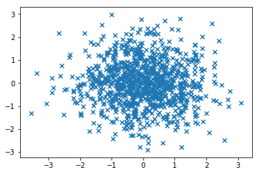


    D:\Anaconda3\lib\site-packages\matplotlib\axes\_axes.py:6462: UserWarning: The 'normed' kwarg is deprecated, and has been replaced by the 'density' kwarg.
      warnings.warn("The 'normed' kwarg is deprecated, and has been "
    D:\Anaconda3\lib\site-packages\matplotlib\axes\_axes.py:6462: UserWarning: The 'normed' kwarg is deprecated, and has been replaced by the 'density' kwarg.
      warnings.warn("The 'normed' kwarg is deprecated, and has been "
    


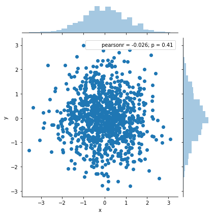


```python
import pandas as pd
import matplotlib.pyplot as plt
import seaborn as sns
#数据准备
x=[2010,2011,2012,2013,2014,2015,2016,2017,2018,2019]
y=[5,3,20,6,17,16,19,30,32,35]
#使用matplotlib画折线图
plt.plot(x,y)
plt.show()
#使用sezborn画折线图
df=pd.DataFrame({'x':x,'y':y})
sns.lineplot(x="x",y="y",data=df)
plt.show()
```


    ---------------------------------------------------------------------------

    AttributeError                            Traceback (most recent call last)

    <ipython-input-14-4389397cebbf> in <module>()
         10 #使用sezborn画折线图
         11 df=pd.DataFrame({'x':x,'y':y})
    ---> 12 sns.lineplot(x="x",y="y",data=df)
         13 plt.show()
    

    AttributeError: module 'seaborn' has no attribute 'lineplot'


```python
import numpy as np
import pandas as pd
import matplotlib.pyplot as plt
import seaborn as sns
#数据准备
a=np.random.randn(100)
s=pd.Series(a)
# 用 Matplotlib 画直方图
plt.hist(s)
plt.show()
# 用 Seaborn 画直方图
sns.distplot(s,kde=False)
plt.show()
sns.distplot(s,kde=True)
plt.show()
```


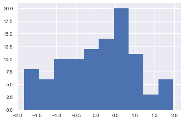


    D:\Anaconda3\lib\site-packages\matplotlib\axes\_axes.py:6462: UserWarning: The 'normed' kwarg is deprecated, and has been replaced by the 'density' kwarg.
      warnings.warn("The 'normed' kwarg is deprecated, and has been "
    


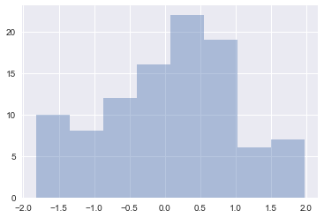


    D:\Anaconda3\lib\site-packages\matplotlib\axes\_axes.py:6462: UserWarning: The 'normed' kwarg is deprecated, and has been replaced by the 'density' kwarg.
      warnings.warn("The 'normed' kwarg is deprecated, and has been "
    


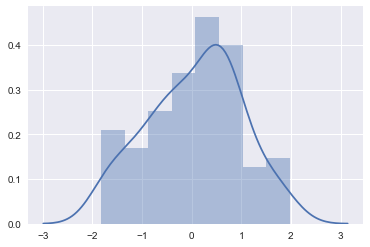


```python
import matplotlib.pyplot as plt
import seaborn as sns
# 数据准备
x = ['Cat1', 'Cat2', 'Cat3', 'Cat4', 'Cat5']
y = [5, 4, 8, 12, 7]
# 用 Matplotlib 画条形图
plt.bar(x, y)
plt.show()
# 用 Seaborn 画条形图
sns.barplot(x, y)
plt.show()
```


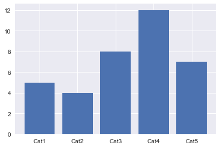


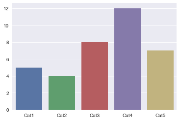


```python
# 数据准备
# 生成 0-1 之间的 10*4 维度数据
data=np.random.normal(size=(10,4)) 
lables = ['A','B','C','D']
# 用 Matplotlib 画箱线图
plt.boxplot(data,labels=lables)
plt.show()
# 用 Seaborn 画箱线图
df = pd.DataFrame(data, columns=lables)
sns.boxplot(data=df)
plt.show()
```


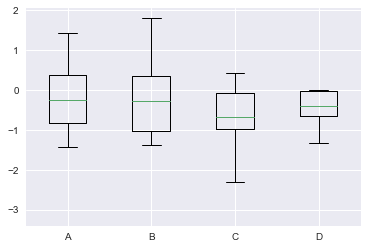


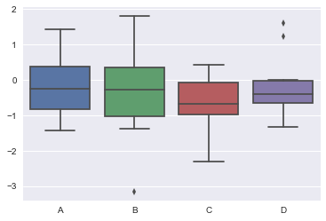


```python
import matplotlib.pyplot as plt
# 数据准备
nums = [25, 37, 33, 37, 6]
labels = ['High-school','Bachelor','Master','Ph.d', 'Others']
# 用 Matplotlib 画饼图
plt.pie(x = nums, labels=labels)
plt.show()
```


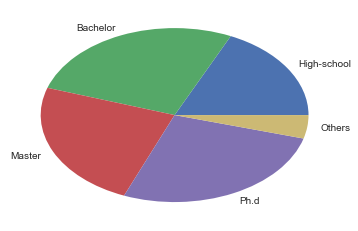


```python
import matplotlib.pyplot as plt
import seaborn as sns
# 数据准备
flights = sns.load_dataset("flights")
data=flights.pivot('year','month','passengers')
# 用 Seaborn 画热力图
sns.heatmap(data)
plt.show()
```


```python
import numpy as np
import matplotlib.pyplot as plt
import seaborn as sns
from matplotlib.font_manager import FontProperties  
# 数据准备
labels=np.array([u" 推进 ","KDA",u" 生存 ",u" 团战 ",u" 发育 ",u" 输出 "])
stats=[83, 61, 95, 67, 76, 88]
# 画图数据准备，角度、状态值
angles=np.linspace(0, 2*np.pi, len(labels), endpoint=False)
stats=np.concatenate((stats,[stats[0]]))
angles=np.concatenate((angles,[angles[0]]))
# 用 Matplotlib 画蜘蛛图
fig = plt.figure()
ax = fig.add_subplot(111, polar=True)   
ax.plot(angles, stats, 'o-', linewidth=2)
ax.fill(angles, stats, alpha=0.25)
# 设置中文字体
font = FontProperties(fname=r"C:\Windows\Fonts\simhei.ttf", size=14)  
ax.set_thetagrids(angles * 180/np.pi, labels, FontProperties=font)
plt.show()
```


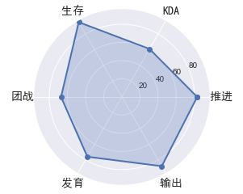


```python
import matplotlib.pyplot as plt
import seaborn as sns
# 数据准备
tips = sns.load_dataset("tips")
print(tips.head(10))
# 用 Seaborn 画二元变量分布图（散点图，核密度图，Hexbin 图）
sns.jointplot(x="total_bill", y="tip", data=tips, kind='scatter')
sns.jointplot(x="total_bill", y="tip", data=tips, kind='kde')
sns.jointplot(x="total_bill", y="tip", data=tips, kind='hex')
plt.show()
```

       total_bill   tip     sex smoker  day    time  size
    0       16.99  1.01  Female     No  Sun  Dinner     2
    1       10.34  1.66    Male     No  Sun  Dinner     3
    2       21.01  3.50    Male     No  Sun  Dinner     3
    3       23.68  3.31    Male     No  Sun  Dinner     2
    4       24.59  3.61  Female     No  Sun  Dinner     4
    5       25.29  4.71    Male     No  Sun  Dinner     4
    6        8.77  2.00    Male     No  Sun  Dinner     2
    7       26.88  3.12    Male     No  Sun  Dinner     4
    8       15.04  1.96    Male     No  Sun  Dinner     2
    9       14.78  3.23    Male     No  Sun  Dinner     2
    

    D:\Anaconda3\lib\site-packages\matplotlib\axes\_axes.py:6462: UserWarning: The 'normed' kwarg is deprecated, and has been replaced by the 'density' kwarg.
      warnings.warn("The 'normed' kwarg is deprecated, and has been "
    D:\Anaconda3\lib\site-packages\matplotlib\axes\_axes.py:6462: UserWarning: The 'normed' kwarg is deprecated, and has been replaced by the 'density' kwarg.
      warnings.warn("The 'normed' kwarg is deprecated, and has been "
    D:\Anaconda3\lib\site-packages\matplotlib\axes\_axes.py:6462: UserWarning: The 'normed' kwarg is deprecated, and has been replaced by the 'density' kwarg.
      warnings.warn("The 'normed' kwarg is deprecated, and has been "
    D:\Anaconda3\lib\site-packages\matplotlib\axes\_axes.py:6462: UserWarning: The 'normed' kwarg is deprecated, and has been replaced by the 'density' kwarg.
      warnings.warn("The 'normed' kwarg is deprecated, and has been "
    


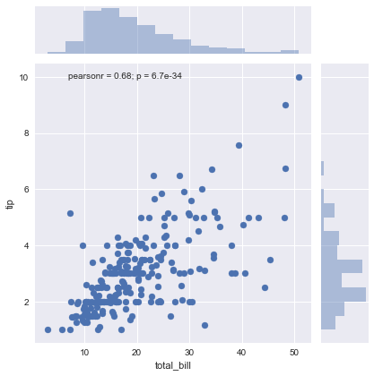


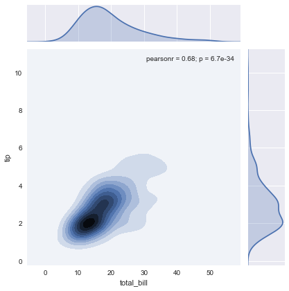


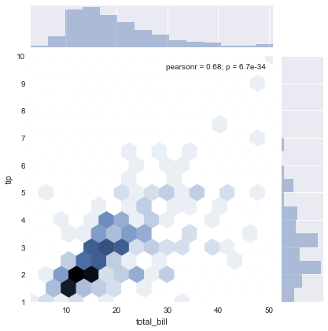


```python
import matplotlib.pyplot as plt
import seaborn as sns
# 数据准备
iris = sns.load_dataset('iris')
# 用 Seaborn 画成对关系
sns.pairplot(iris)
plt.show()
```


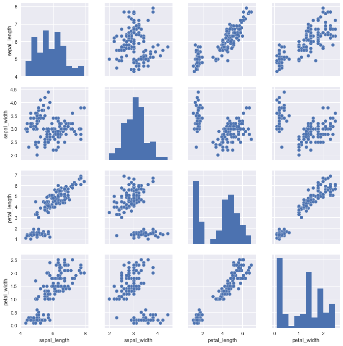

